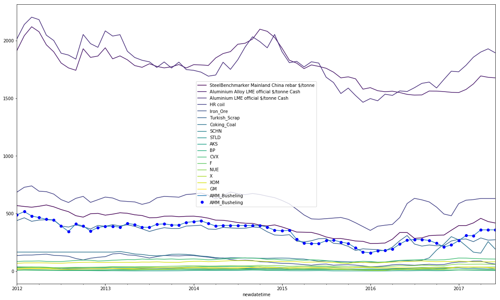
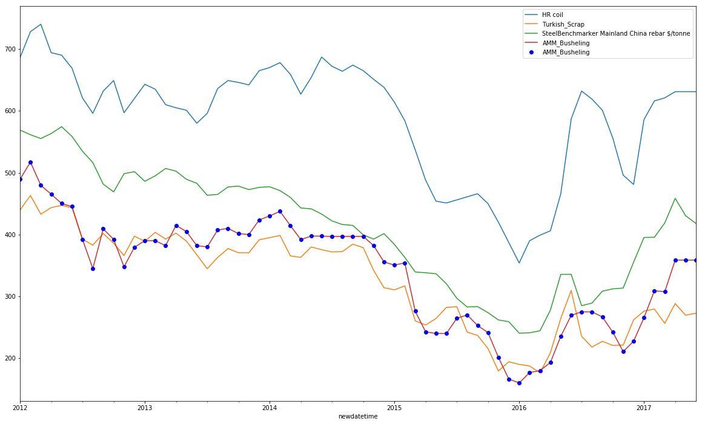
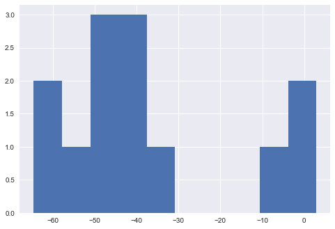
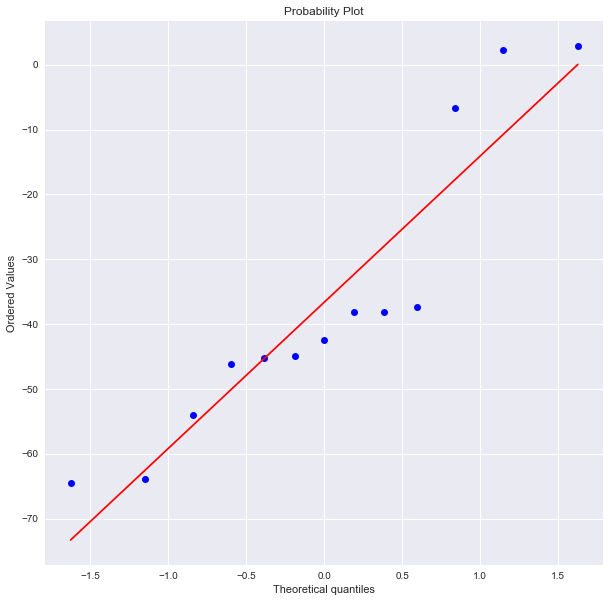
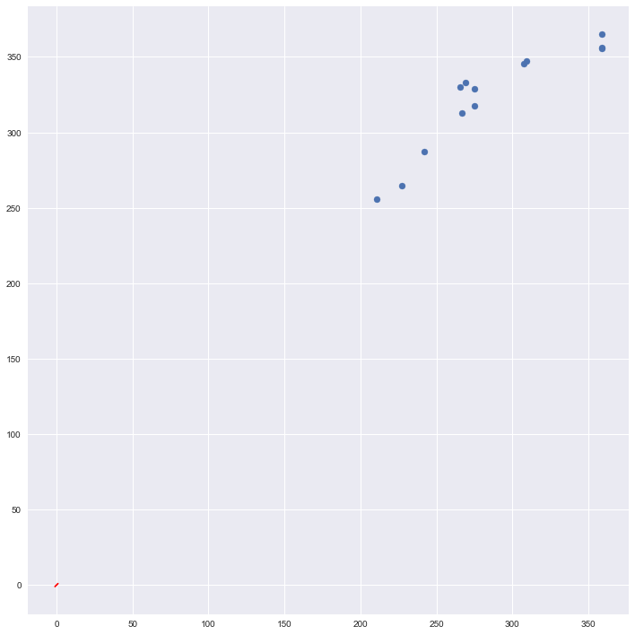
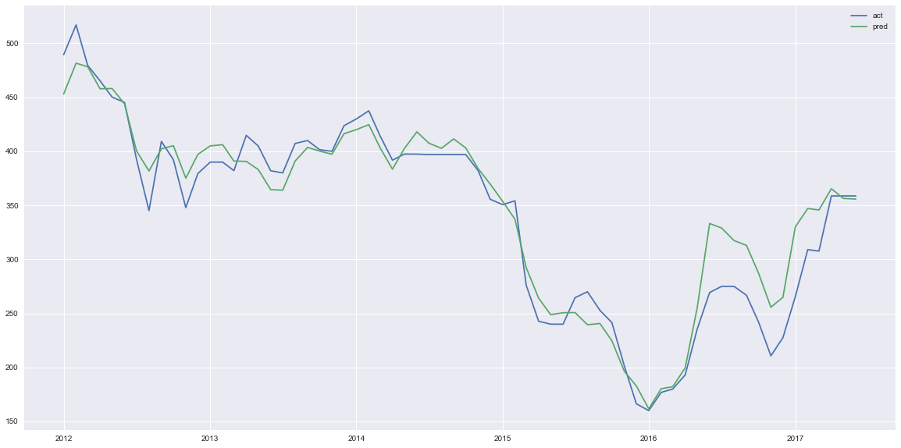
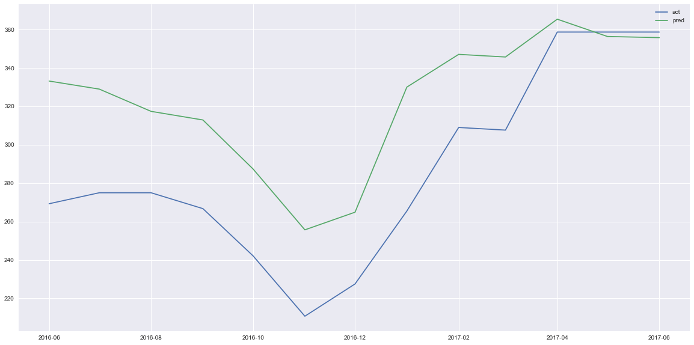
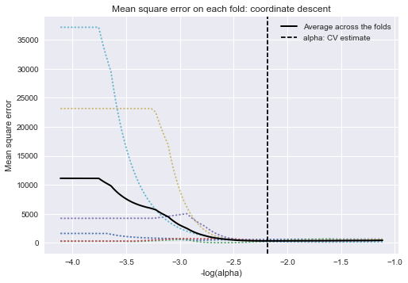

```python
cd /Users/larrykite/BRS/Scrap_Analytics/Data/Composite_Index_LK/
```

    /Users/larrykite/BRS/Scrap_Analytics/Data/Composite_Index_LK
    


```python
from sklearn.model_selection import TimeSeriesSplit
from sklearn import linear_model as lm

import pandas as pd
import numpy as np
from datetime import datetime as dt
```


```python
def aggregate_month(SDFP):
    SDF = SDFP.copy()
    from datetime import timedelta
    SDF.loc[:, 'month'] = SDF.index.month
    SDF.loc[:, 'year'] = SDF.index.year
    SDFagg = SDF.groupby(['year', 'month']).agg(np.mean)
    SDFagg = SDFagg.reset_index()
    SDFagg.loc[:, 'monthdate'] = [str(int(y)) + '-' + str(int(m)) + '-' + '01' for (y, m) in zip(SDFagg.year, SDFagg.month)]
    SDFagg.index = pd.to_datetime(SDFagg.monthdate)
    SDFagg.loc[:, 'newdatetime'] = [pd.to_datetime(dt.strptime(dt.strftime(x + timedelta(days=32), format='%Y-%m-%d')[:9] + '1', '%Y-%m-%d')) for x in SDFagg.index]
    SDFagg.index = SDFagg.newdatetime
    SDFagg.drop(['year', 'month', 'monthdate', 'newdatetime'], axis=1, inplace=True)
    SDFagg = SDFagg.fillna(method='bfill')
    return SDFagg
```


```python
# Second Best so far:
# first_date = '2012-01-01'
# last_train_date = '2014-01-01'

# Best so far:
first_date = '2012-01-01'
last_train_date = '2016-05-02'

pre_normalize = False
fit_intercept = True
normalize_data = False
#first_date = '2012-04-01'
#last_train_date = '2016-01-01'

usecols = [u'MBIO Index Iron Ore 62% Fe fines CFR Qingdao US $/tonne', 
           u'SteelBenchmarker Mainland China rebar $/tonne', 
           u'SteelBenchmarker USA hot rolled coil East of the Mississippi $/ metric tonne',
           u'Turkey export reinforcing bar (rebar) FOB main port $/tonne ',
           u'Aluminium Alloy LME official $/tonne Cash',
           u'Aluminium LME official $/tonne Cash',
           u'Aluminum Alloy Nasaac LME official $/tonne Cash',
           u'Aluminum P1020 premium delivered Midwest cents/lb',
           u'Copper Cathode premium Grade 1 delivered domestic US cents/lb', 
           u'Lead premium 99.97% purity delivered domestic US cents/lb',
           u'Nickel melting material premium 99.8% purity delivered domestic US cents/lb',
           u'Nickel plating material premium 99.8% purity delivered domestic US cents/lb',
           u'No. 1 busheling US domestic Midwest Index $/gross ton',
           u'No. 1 heavy melt scrap US domestic Midwest Index $/gross ton', 
           u'Special High Grade Zinc premium delivered domestic US cents/lb',
           u'Tin Grade A 99.85% premium delivered domestic US $ per tonne', 
           u'Chicago No. 1 bundles scrap consumer buying price $/gross ton',
           u'Chicago No. 1 busheling scrap consumer buying price $/gross ton', 
           u'Chicago No. 1 heavy melt scrap consumer buying price $/gross ton',
           u'Chicago No. 2 bundles scrap consumer buying price $/gross ton']
usecols += [u'AMM_Busheling', u'HR coil', u'DJIA', u'NASDAQCOM', u'NASDAQ100', u'SP500', u'Iron_Ore', u'Turkish_Scrap', u'Coking_Coal']
CIS = pd.read_csv('coal_ironore_turkishscrap_processed.csv', index_col='Date', parse_dates=['Date'])
SMI = pd.read_csv('stock_market_indices.csv', index_col='Date', parse_dates=['Date'])
#IDX = SMI[['DJIA', 'NASDAQCOM', 'NASDAQ100', 'SP500']]

AMM = pd.read_csv('AMM_pandas.csv', index_col=0, parse_dates=['Date'])

IDX = SMI[['AMM_Busheling', 'HR coil', 'DJIA', 'NASDAQCOM', 'NASDAQ100', 'SP500']]

```


```python
GM = pd.read_csv('GM.csv', index_col=0, parse_dates=True)
STOCKS = pd.read_csv('Stocks_Adj_Close.csv', index_col=0, parse_dates=['Date'])
STOCKS = STOCKS.drop(["GM", "ACO"], axis=1)
GM = pd.DataFrame(GM['Adj Close'])
STOCKS = STOCKS.join(GM, how='left').rename(columns={'Adj Close': 'GM'})
```


```python
STOCKS_AGG = aggregate_month(STOCKS)
```


```python
CIS = aggregate_month(CIS)
IDX = aggregate_month(IDX)
AMM = aggregate_month(AMM)
```


```python
G = IDX.join(AMM, how='left')
G = G.join(CIS, how='left')

G = G[usecols]
G = G.join(STOCKS_AGG, how='left')
G = G.fillna(method='ffill').fillna(method='bfill')

#G.loc['2009-11-25', 'Aluminum Alloy Nasaac LME official $/tonne Cash'] = G.loc['2009-11-24', 'Aluminum Alloy Nasaac LME official $/tonne Cash']

#lead_prem = G['Lead premium 99.97% purity delivered domestic US cents/lb']
#lead_prem.loc['2005-01-11':'2005-02-14'] = (lead_prem.loc['2005-01-10'] + lead_prem.loc['2005-02-15']) / 2.


corr_series = G.corr().loc['AMM_Busheling'].sort_values(ascending=False)
```


```python
corr_series
```


    AMM_Busheling                                                                   1.000000
    Chicago No. 1 busheling scrap consumer buying price $/gross ton                 0.999971
    Chicago No. 1 bundles scrap consumer buying price $/gross ton                   0.999473
    Chicago No. 2 bundles scrap consumer buying price $/gross ton                   0.958319
    Chicago No. 1 heavy melt scrap consumer buying price $/gross ton                0.957853
    HR coil                                                                         0.930110
    SteelBenchmarker Mainland China rebar $/tonne                                   0.834280
    SCHN                                                                            0.834195
    Aluminium Alloy LME official $/tonne Cash                                       0.828165
    Aluminum Alloy Nasaac LME official $/tonne Cash                                 0.786770
    Aluminium LME official $/tonne Cash                                             0.743333
    Tin Grade A 99.85% premium delivered domestic US $ per tonne                    0.731168
    Nickel plating material premium 99.8% purity delivered domestic US cents/lb     0.708624
    SteelBenchmarker USA hot rolled coil East of the Mississippi $/ metric tonne    0.705764
    NUE                                                                             0.698331
    XOM                                                                             0.665360
    CVX                                                                             0.650823
    BP                                                                              0.640858
    STLD                                                                            0.633360
    Turkish_Scrap                                                                   0.629697
    Copper Cathode premium Grade 1 delivered domestic US cents/lb                   0.616685
    Iron_Ore                                                                        0.614911
    X                                                                               0.608884
    Nickel melting material premium 99.8% purity delivered domestic US cents/lb     0.514612
    No. 1 heavy melt scrap US domestic Midwest Index $/gross ton                    0.463379
    Lead premium 99.97% purity delivered domestic US cents/lb                       0.424834
    Aluminum P1020 premium delivered Midwest cents/lb                               0.400136
    AKS                                                                             0.342371
    No. 1 busheling US domestic Midwest Index $/gross ton                           0.281115
    Special High Grade Zinc premium delivered domestic US cents/lb                  0.174324
    DJIA                                                                            0.119412
    NASDAQ100                                                                       0.093363
    NASDAQCOM                                                                       0.092915
    Turkey export reinforcing bar (rebar) FOB main port $/tonne                     0.057448
    MBIO Index Iron Ore 62% Fe fines CFR Qingdao US $/tonne                        -0.018969
    Coking_Coal                                                                    -0.049549
    SP500                                                                          -0.094067
    F                                                                              -0.199050
    GM                                                                             -0.251302
    Name: AMM_Busheling, dtype: float64


```python
dropcols = [x for x in G.columns if 'composite' in x] + [u'Chicago No. 1 busheling scrap consumer buying price $/gross ton',
                                                         u'SteelBenchmarker USA hot rolled coil East of the Mississippi $/ metric tonne',
                                                         u'No. 1 busheling US domestic Midwest Index $/gross ton',
                                                         u'Turkey export reinforcing bar (rebar) FOB main port $/tonne ',
                                                         u'Aluminum P1020 premium delivered Midwest cents/lb',
                                                         u'Nickel plating material premium 99.8% purity delivered domestic US cents/lb',
                                                         u'No. 1 heavy melt scrap US domestic Midwest Index $/gross ton',
                                                         u'Chicago No. 1 heavy melt scrap consumer buying price $/gross ton',
                                                         u'Chicago No. 2 bundles scrap consumer buying price $/gross ton',
                                                         u'Nickel melting material premium 99.8% purity delivered domestic US cents/lb',
                                                         u'Lead premium 99.97% purity delivered domestic US cents/lb',
                                                         u'Tin Grade A 99.85% premium delivered domestic US $ per tonne',
                                                         u'Special High Grade Zinc premium delivered domestic US cents/lb',
                                                         #u'Aluminium LME official $/tonne Cash',
                                                        #u'SteelBenchmarker Mainland China rebar $/tonne',
                                                        #u'Aluminium Alloy LME official $/tonne Cash',
                                                        u'Aluminum Alloy Nasaac LME official $/tonne Cash',
                                                        #u'Turkish_Scrap',
                                                        #u'Iron_Ore',
                                                        u'MBIO Index Iron Ore 62% Fe fines CFR Qingdao US $/tonne',
                                                        #u'Coking_Coal',
                                                          u'Copper Cathode premium Grade 1 delivered domestic US cents/lb'] 
                                                         #u'Aluminum Alloy Nasaac LME official $/tonne Cash']
G.drop(dropcols, axis=1, inplace=True)

G.drop('DJIA', axis=1, inplace=True)

G.drop(['NASDAQCOM', 'NASDAQ100', 'SP500'], axis=1, inplace=True)

#G.drop(u'MBIO Index Iron Ore 62% Fe fines CFR Qingdao US $/tonne', axis=1, inplace=True)
#G.drop('Coking_Coal', axis=1, inplace=True)
```


```python
# Correlation of entire data set (even for dates that precede the "first_date")
corr_series = G.corr().loc['AMM_Busheling'].sort_values(ascending=False)
corr_series
```


    AMM_Busheling                                                    1.000000
    Chicago No. 1 bundles scrap consumer buying price $/gross ton    0.999473
    HR coil                                                          0.930110
    SteelBenchmarker Mainland China rebar $/tonne                    0.834280
    SCHN                                                             0.834195
    Aluminium Alloy LME official $/tonne Cash                        0.828165
    Aluminium LME official $/tonne Cash                              0.743333
    NUE                                                              0.698331
    XOM                                                              0.665360
    CVX                                                              0.650823
    BP                                                               0.640858
    STLD                                                             0.633360
    Turkish_Scrap                                                    0.629697
    Iron_Ore                                                         0.614911
    X                                                                0.608884
    AKS                                                              0.342371
    Coking_Coal                                                     -0.049549
    F                                                               -0.199050
    GM                                                              -0.251302
    Name: AMM_Busheling, dtype: float64


```python
# Correlation of training + testing sets
G.loc[first_date:].corr().loc['AMM_Busheling'].sort_values(ascending=False)
```


    AMM_Busheling                                                    1.000000
    Chicago No. 1 bundles scrap consumer buying price $/gross ton    0.998588
    Turkish_Scrap                                                    0.942642
    SteelBenchmarker Mainland China rebar $/tonne                    0.917052
    HR coil                                                          0.911975
    Iron_Ore                                                         0.868145
    SCHN                                                             0.797564
    Aluminium LME official $/tonne Cash                              0.776991
    Aluminium Alloy LME official $/tonne Cash                        0.755529
    AKS                                                              0.473552
    X                                                                0.468302
    BP                                                               0.391500
    Coking_Coal                                                      0.309880
    CVX                                                              0.271810
    XOM                                                             -0.018540
    NUE                                                             -0.214083
    F                                                               -0.236205
    GM                                                              -0.414844
    STLD                                                            -0.415956
    Name: AMM_Busheling, dtype: float64


```python
# Correlation of training set only
G.loc[first_date:last_train_date].corr().loc['AMM_Busheling'].sort_values(ascending=False)
```


    AMM_Busheling                                                    1.000000
    Chicago No. 1 bundles scrap consumer buying price $/gross ton    0.999510
    HR coil                                                          0.972122
    Turkish_Scrap                                                    0.966710
    SteelBenchmarker Mainland China rebar $/tonne                    0.922987
    SCHN                                                             0.880230
    Iron_Ore                                                         0.875384
    Coking_Coal                                                      0.824898
    Aluminium LME official $/tonne Cash                              0.765498
    Aluminium Alloy LME official $/tonne Cash                        0.744698
    AKS                                                              0.656303
    X                                                                0.607320
    CVX                                                              0.416416
    BP                                                               0.403024
    XOM                                                              0.129280
    NUE                                                             -0.094328
    F                                                               -0.263163
    GM                                                              -0.402971
    STLD                                                            -0.518442
    Name: AMM_Busheling, dtype: float64


```python
# Correlation of testing set only
G.loc[last_train_date:].corr().loc['AMM_Busheling'].sort_values(ascending=False)
```


    AMM_Busheling                                                    1.000000
    Chicago No. 1 bundles scrap consumer buying price $/gross ton    0.999113
    Aluminium Alloy LME official $/tonne Cash                        0.848019
    HR coil                                                          0.803905
    Aluminium LME official $/tonne Cash                              0.786656
    SteelBenchmarker Mainland China rebar $/tonne                    0.760978
    NUE                                                              0.642898
    STLD                                                             0.623805
    GM                                                               0.527193
    Turkish_Scrap                                                    0.502299
    X                                                                0.453715
    Iron_Ore                                                         0.441777
    CVX                                                              0.430659
    BP                                                               0.371728
    AKS                                                              0.280906
    Coking_Coal                                                     -0.077969
    SCHN                                                            -0.129762
    F                                                               -0.175797
    XOM                                                             -0.438116
    Name: AMM_Busheling, dtype: float64


```python

if pre_normalize:
    GN = (G - G.mean()) / G.std()
else:
    GN = G

GN = GN.loc[first_date:]
X = GN.drop(['AMM_Busheling', u'Chicago No. 1 bundles scrap consumer buying price $/gross ton'], axis=1)
y = GN['AMM_Busheling']

X_train = X.loc[:last_train_date]
X_test = X.loc[last_train_date:]
y_train = y.loc[:last_train_date]
y_test = y.loc[last_train_date:]
```


```python

```


```python

scv = TimeSeriesSplit(n_splits=6)
cvModel = lm.LassoCV(cv=scv, n_alphas=2000, positive=True, copy_X=True, fit_intercept=fit_intercept, normalize=normalize_data)
cvModel.fit(X_train, y_train)
```


    LassoCV(alphas=None, copy_X=True, cv=TimeSeriesSplit(n_splits=6), eps=0.001,
        fit_intercept=True, max_iter=1000, n_alphas=2000, n_jobs=1,
        normalize=False, positive=True, precompute='auto', random_state=None,
        selection='cyclic', tol=0.0001, verbose=False)


```python
CM = cvModel
CM.get_params()
```


    {'alphas': None,
     'copy_X': True,
     'cv': TimeSeriesSplit(n_splits=6),
     'eps': 0.001,
     'fit_intercept': True,
     'max_iter': 1000,
     'n_alphas': 2000,
     'n_jobs': 1,
     'normalize': False,
     'positive': True,
     'precompute': 'auto',
     'random_state': None,
     'selection': 'cyclic',
     'tol': 0.0001,
     'verbose': False}


```python
CM.alpha_
```


    153.68201824444449


```python
lf = lm.Lasso(alpha=cvModel.alpha_, positive=True, fit_intercept=fit_intercept, normalize=normalize_data)
lf.fit(X_train, y_train)
```


    Lasso(alpha=153.68201824444449, copy_X=True, fit_intercept=True,
       max_iter=1000, normalize=False, positive=True, precompute=False,
       random_state=None, selection='cyclic', tol=0.0001, warm_start=False)


```python
lf.get_params()
```


    {'alpha': 153.68201824444449,
     'copy_X': True,
     'fit_intercept': True,
     'max_iter': 1000,
     'normalize': False,
     'positive': True,
     'precompute': False,
     'random_state': None,
     'selection': 'cyclic',
     'tol': 0.0001,
     'warm_start': False}


```python
lf.intercept_
```


    -113.00205503847309


```python
modelDF = pd.DataFrame()

modelDF['Columns'] = X_train.columns

modelDF['Coeff'] = lf.coef_

modelDF.sort_values('Coeff', ascending=False)
```


```python
%matplotlib inline
X.plot(figsize=(20,12), colormap='viridis')
GN['AMM_Busheling'].plot()
GN['AMM_Busheling'].plot(style='bo')
#plt.plot(vframe.index, vframe.ltd, 'r-')
plt.axvline(last_train_date, X.min().min(), X.max().max(), color='darkgray')
plt.legend()
# plt.show()
```


    <matplotlib.legend.Legend at 0x1157b3b90>





```python
%matplotlib inline
pos_coeffs = modelDF[modelDF.Coeff>0]
X[list(pos_coeffs.sort_values('Coeff', ascending=False)['Columns'])].plot(figsize=(20,12))
GN['AMM_Busheling'].plot()
GN['AMM_Busheling'].plot(style='bo')
plt.axvline(last_train_date, X.min().min(), X.max().max(), color='darkgray')
plt.legend()
```


    <matplotlib.legend.Legend at 0x1158a5f10>





```python
import seaborn as sns
cseries = pd.Series(lf.coef_)
barp = cseries.plot.bar(figsize=(20, 10))
barp.set_xticklabels(modelDF['Columns'], rotation=-90)
barp.tick_params(labelsize=20)
plt.show()
```


```python
yPred = lf.predict(X_test)
```


```python
#plt.hist(y_test-yPred)
plt.hist(y_test-yPred.flatten())
plt.show()
```





```python
import numpy as np 
import pylab 
import scipy.stats as stats
```


```python
yPred = yPred.flatten()
f = plt.figure(figsize=(10, 10))
stats.probplot(y_test-yPred, dist="norm", plot=pylab)
pylab.show()
```





```python
f = plt.figure(figsize=(10, 10))
plt.scatter(x=y_test, y=yPred)
plt.plot(np.arange(-1., 1., 0.05), np.arange(-1., 1., 0.05), 'r-')
plt.tight_layout()
plt.show()
```





```python
corr = np.corrcoef(y_test, yPred)[0,1]

r2 = corr ** 2

r2
```


    0.8345633340729518


```python
corr**2
```


    0.8345633340729518


```python
testDF = GN.loc[last_train_date:]
```


```python
hatDF = GN.copy()
yhat = lf.predict(X).flatten()
hatDF.loc[:, 'Prediction'] = yhat
f = plt.figure(figsize=(20, 10))
plt.plot(hatDF.index, hatDF.AMM_Busheling, label='act')
plt.plot(hatDF.index, hatDF.Prediction, label='pred')
plt.axvline(last_train_date, X.min().min(), X.max().max(), color='darkred')

plt.legend()
plt.show()
```





```python
testDF.loc[:, 'Prediction'] = yPred

f = plt.figure(figsize=(20, 10))
plt.plot(testDF.index, testDF.AMM_Busheling, label='act')
plt.plot(testDF.index, testDF.Prediction, label='pred')
plt.legend()
plt.show()
```

    /Users/larrykite/.virtualenvs/mypythonenv/lib/python2.7/site-packages/pandas/core/indexing.py:297: SettingWithCopyWarning: 
    A value is trying to be set on a copy of a slice from a DataFrame.
    Try using .loc[row_indexer,col_indexer] = value instead
    
    See the caveats in the documentation: http://pandas.pydata.org/pandas-docs/stable/indexing.html#indexing-view-versus-copy
      self.obj[key] = _infer_fill_value(value)
    /Users/larrykite/.virtualenvs/mypythonenv/lib/python2.7/site-packages/pandas/core/indexing.py:561: SettingWithCopyWarning: 
    A value is trying to be set on a copy of a slice from a DataFrame.
    Try using .loc[row_indexer,col_indexer] = value instead
    
    See the caveats in the documentation: http://pandas.pydata.org/pandas-docs/stable/indexing.html#indexing-view-versus-copy
      self.obj[item_labels[indexer[info_axis]]] = value
    





```python
from sklearn import metrics

metrics.mean_absolute_error(y_test, yPred)
```


    37.435319996851483


```python
from sklearn.metrics import explained_variance_score, median_absolute_error, mean_squared_error

explained_variance_score(y_test, yPred, multioutput='raw_values')[0]
```


    0.79188330780172678


```python
median_absolute_error(y_test, yPred)
```


    42.39304885915908


```python
np.sqrt(mean_squared_error(y_test, yPred))
```


    42.531887684625509


```python
from sklearn.metrics import r2_score

r2_score(y_test, yPred)
```


    0.19401006005211918


```python
print "c.d. test:", lf.score(X_test, y_test)

print "c.d. train:", lf.score(X_train, y_train)

print "c.d. all:", lf.score(X, y)
```

    c.d. test: 0.194010060052
    c.d. train: 0.970125136579
    c.d. all: 0.928453835652
    


```python
# Display results
m_log_alphas = -np.log10(cvModel.alphas_)

plt.figure()
#ymin, ymax = 2300, 3800
plt.plot(m_log_alphas, cvModel.mse_path_, ':')
plt.plot(m_log_alphas, cvModel.mse_path_.mean(axis=-1), 'k',
         label='Average across the folds', linewidth=2)
plt.axvline(-np.log10(cvModel.alpha_), linestyle='--', color='k',
            label='alpha: CV estimate')

plt.legend()

plt.xlabel('-log(alpha)')
plt.ylabel('Mean square error')
plt.title('Mean square error on each fold: coordinate descent')
plt.axis('tight')
```


    (-4.2635865370475923,
     -0.96358653704759167,
     -1833.3113647047139,
     38986.610558421766)





```python

```
